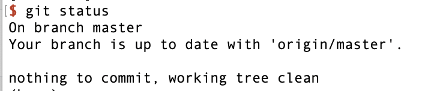
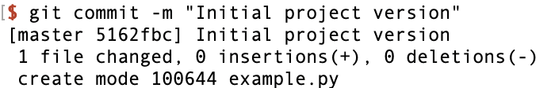
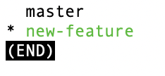
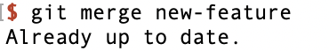
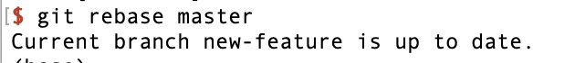
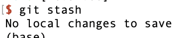

# Git_introduction

## 0.Read before the tutorial

### 0.1 Who is this tutorial for?

This tutorial is specifically designed for beginners who have little to no experience with Git, a popular version control system. It is tailored for software developers, programmers, coders, or anyone involved in managing codebases and looking to adopt Git for their project management needs. Additionally, students, hobbyists, or professionals transitioning to collaborative coding environments will also find this tutorial beneficial.

### 0.2 Purpose of the tutorial

The primary objectives of this tutorial are:

1. To introduce the fundamental concepts and terminologies related to Git.
2. To guide readers through the installation process and basic setup of Git.
3. To teach essential Git commands and workflows for version control, including creating branches, committing changes, and resolving conflicts.
4. To familiarize users with popular Git hosting services such as GitHub, GitLab, and Bitbucket.
5. To lay the groundwork for more advanced Git usage and encourage continuous learning.

### 0.3 What You Need Before You Read

To get the most out of this tutorial, ensure you have the following:

1. A computer running any operating system (Windows, macOS, or Linux).
2. Administrative privileges to install software on your computer.
3. Basic understanding of command-line interfaces (CLI), although not strictly required, a basic CLI knowledge will be helpful.
4. Motivation and enthusiasm to learn a new tool that can significantly improve your coding and collaboration skills.

Once you've set these prerequisites, you're all set to embark on your Git learning journey!

## 1.Introduction to Git for CS Students

Welcome to this Git tutorial! Whether you are working on a small personal project or collaborating on a large codebase, understanding version control is crucial in the world of computer science and software development. Git, a powerful and widely-used version control system, is an essential tool for developers. In this tutorial, we will explore the basics of Git, helping you to manage your coding projects more effectively.

### 1.1 What is Git?

Git is a distributed version control system created by Linus Torvalds in 2005. It allows multiple developers to work together on the same project without interfering with each other's work. Git tracks the changes you make to files, so you have a complete history and can revert to specific versions should you need to. It's also incredibly useful for managing changes to projects over time.

### 1.2 **Installation**

To begin your journey with Git, download and install it onto your computer from the official website (https://git-scm.com/downloads). Once installed, initialize Git in a local directory using the command `git init`.

And use `$ git --version` to check the version of Git.

#### Installing Git on macOS

1. **Download Git**: Visit the official Git website at [https://git-scm.com/download/mac](https://git-scm.com/download/mac) to download the latest version of Git for macOS.

2. **Install Git**: Once downloaded, double-click the `.pkg` file to start the installation process. Follow the on-screen instructions, accepting the default options unless you have specific requirements.

3. **Check Installation**: After installation, open the Terminal application (found in `/Applications/Utilities/Terminal.app`). Type `git --version` and press Enter. If Git was installed correctly, it will display the version number indicating that it's ready to use.

#### Installing Git on Windows

1. **Download Git**: Go to the Git for Windows installer page at [https://git-scm.com/download/win](https://git-scm.com/download/win) and download the latest release.

2. **Run Installer**: Run the downloaded `.exe` file, and choose "Next" throughout the installation wizard, ensuring to select the option to "Use Git from the Windows Command Prompt" and/or "Use Git and optional Unix tools from the Windows PowerShell" during the Configuring the terminal emulator section.

3. **Path Settings**: Make sure Git is added to your PATH environment variable during installation so that you can run Git from any command prompt.

4. **Verify Installation**: Open Command Prompt and type `git --version`, then press Enter. If Git is properly installed, it will show you the version information.

#### Installing Git on Linux

For most Linux distributions, Git is available via package managers. Here's a general outline for some common distributions:

**Ubuntu/Debian based:**
```bash
sudo apt update
sudo apt install git
```

**Fedora/RHEL/CentOS based:**
```bash
sudo dnf install git
# Or for older versions using yum:
sudo yum install git
```

**Arch Linux and derivatives:**
```bash
sudo pacman -Syu git
```

**Verify Installation:**
In any Linux terminal after installation, type `git --version` and press Enter to verify that Git is working correctly.

#### Configuring Git

Regardless of the platform, after installing Git, it's essential to configure your global settings. These include your name and email, which are used to sign off on your commits.

**Global Configuration Steps:**

1. **Set Your Username**: Open a terminal window and type:
   ```sh
   git config --global user.name "Your Full Name"
   ```

2. **Set Your Email**: Replace `"Your Full Name"` with your actual name, and then set your email address with:
   ```sh
   git config --global user.email "youremail@example.com"
   ```

3. **Optional Customizations**: You may also want to set other preferences such as text editor, core.autocrlf for line ending conversions, and aliases for frequently used commands. For example:
   ```sh
   git config --global core.editor "vim"
   git config --global core.autocrlf input
   git config --global alias.co checkout
   ```

Remember, these configurations are global and apply to all Git repositories on your machine. If you need repository-specific configurations, navigate to the repository directory and omit the `--global` flag.

### 1.2 Why Use Git?

1. **Track Changes:** Git keeps a record of every modification to the code. If something goes wrong, it's easy to compare earlier versions of the code to help find the cause.

2. **Collaboration:** Multiple people can work on the same project simultaneously. Git manages changes made by multiple people efficiently, ensuring that parallel work doesn't conflict.

3. **Branching and Merging:** Git's branching feature lets you create separate branches for different features or sections of your project. Once a feature is complete, you can merge that branch back into the main project.

4. **Remote Repositories:** With Git, you can keep a local repository on your machine and a remote repository online (like on GitHub), allowing for easy backups and collaboration.

Throughout this tutorial, we'll be using a sample coding project to demonstrate various Git commands and workflows, including setting up a repository, making and tracking changes, branching, merging, and more. Our goal is to equip you with the knowledge and skills to use Git confidently in your projects.

Let's get started!

## 2.Simple Usage of Git

1. **git init**: This command initializes a new Git repository. It creates a new subdirectory named `.git` that houses all necessary repository files – a skeletal repository. We touch a folder called “example”. Use it when starting a new project.

   

   ```bash
   git init
   ```

   The result is 

   ```shell
   Initialized empty Git repository in /Users/XXX/example/.git/
   ```

2. **git clone [url]**: Used to copy a Git repository from an existing URL. It's a way to download and work on a project that's been shared via a Git repository (Take `https://github.com/piglei/zkpython_example` for an example).

   ```bash
   git clone https://github.com/example/repo.git
   ```

   The result is

   ```shell
   git clone https://github.com:piglei/zkpython_example.git
   Cloning into 'zkpython_example'...
   remote: Enumerating objects: 14, done.
   remote: Total 14 (delta 0), reused 0 (delta 0), pack-reused 14
   Receiving objects: 100% (14/14), 7.91 KiB | 7.91 MiB/s, done.
   Resolving deltas: 100% (2/2), done.
   ```

   

3. **git status**: Displays the status of the working directory and staging area. It lets you see which changes have been staged, which haven't, and which files aren't being tracked by Git.

   ```bash
   git status
   ```

   The result is

   ```shell
   cd zkpython_example
   git status
   On branch master
   Your branch is up to date with 'origin/master'.
   
   nothing to commit, working tree clean
   ```

   

4. **git add [file]**: Adds a file to the staging area. It's a way to tell Git that you want to include updates to a particular file in the next commit. You can use `git add .` to add all new and changed files to the staging area. Now we first touch a py file called “example.py”

   ```bash
   git add example.py
   ```

   If there is no hint, we success.

   

5. **git commit -m "[commit message]"**: Records or snapshots the file permanently in the version history with a descriptive message. The message should be clear and descriptive of the changes made.

   ```bash
   git commit -m "Initial project version"
   ```

   The result is

   ```shell
   git commit -m "Initial project version"
   [master 5162fbc] Initial project version
    1 file changed, 0 insertions(+), 0 deletions(-)
    create mode 100644 example.py
   ```

   

6. **git branch [branch-name]**: Creates a new branch. Branches are used to develop features isolated from each other.

   ```bash
   git branch new-feature
   ```

   Then we search branch

   ```shell
   * master
     new-feature
   (END)
   ```

7. **git checkout [branch-name]**: Switches to a specified branch and updates the working directory to match.

   ```bash
   git checkout new-feature
   ```

   The result is

   ```shell
   git checkout new-feature
   Switched to branch 'new-feature'
   ```

   

8. **git merge [branch]**: Merges the specified branch’s history into the current branch. This is usually done in the main branch to bring in new features or fixes.

   ```bash
   git merge new-feature
   ```

   The result is

   ```shell
   git merge new-feature
   Already up to date.
   ```

   

9. **git rebase [branch]**: Reapply commits on top of another base tip. It's used to integrate changes from one branch into another.

   ```bash
   git rebase master
   ```

   The result is

   ```shell
   git rebase master
   Current branch new-feature is up to date.
   ```

   

10. **git stash**: Temporarily shelves or stashes changes you've made to your working copy so you can work on something else, and then come back and re-apply them later on.

    ```bash
    git stash
    ```

    The result is 

    ```shell
    $ git stash
    No local changes to save
    ```

    

11. **git stash pop**: Reapplies the changes that were stashed away by `git stash`.

    ```bash
    git stash pop
    ```

12. **git log**: Shows the commit logs.

    ```bash
    git log
    ```


13. **git pull**: Fetches and merges changes on the remote server to your working directory.

    ```bash
    git pull
    ```

14. **git push**: Pushes the changes in your local repository to a remote repository.

    ```bash
    git push origin master
    ```

    The result is

    ```shell
    ERROR: Permission to piglei/zkpython_example.git denied to username.
    fatal: Could not read from remote repository.
    
    Please make sure you have the correct access rights
    and the repository exists.
    
    ```

    This typically indicates an issue with access permissions to the Git repository. The most common cause is that the user `username` does not have permission to access the `piglei/zkpython_example.git` repository. If we are the repository owner, we need to add `username` as a collaborator. If we are `username`, you should request access from the repository owner.

## Further Reading and Resources

+ Git Documentation: https://git-scm.com/doc
+ Interactive Git Tutorial: https://try.github.io/
+ Pro Git Book: https://git-scm.com/book/en/v2
